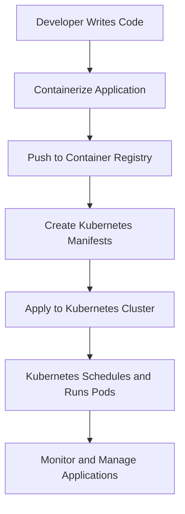

# Kubernetes Mastery: From Fundamentals to Production-Ready Deployments

## Foreword

In the rapidly evolving landscape of cloud-native technologies, Kubernetes has emerged as the de facto standard for container orchestration. This comprehensive guide is designed to take you on a transformative journey from understanding the basic concepts to implementing complex, production-ready Kubernetes architectures.

## Table of Contents
1. [Introduction to Modern Containerization](#chapter-1-introduction-to-modern-containerization)
2. [Kubernetes Fundamentals](#chapter-2-kubernetes-fundamentals)
3. [Deep Dive into Kubernetes Architecture](#chapter-3-deep-dive-into-kubernetes-architecture)
4. [Core Kubernetes Resources](#chapter-4-core-kubernetes-resources)
5. [Networking and Service Discovery](#chapter-5-networking-and-service-discovery)
6. [State Management and Persistent Storage](#chapter-6-state-management-and-persistent-storage)
7. [Security and Access Control](#chapter-7-security-and-access-control)
8. [Scaling and Performance Optimization](#chapter-8-scaling-and-performance-optimization)
9. [Monitoring and Observability](#chapter-9-monitoring-and-observability)
10. [Advanced Kubernetes Patterns](#chapter-10-advanced-kubernetes-patterns)
11. [Production Readiness](#chapter-11-production-readiness)

## Chapter 1: Introduction to Modern Containerization

### The Evolution of Software Deployment

#### Bare Metal Era
In the early days of computing, applications were deployed directly on physical servers. This approach presented numerous challenges:
- Limited resource utilization
- Complex manual configuration
- Difficulty in scaling
- Environment inconsistencies

#### Virtual Machines (VMs)
Virtual machines introduced a significant improvement:
- Better resource isolation
- Improved hardware utilization
- Easier system-level separation
- Hypervisor-based virtualization

#### Containerization Revolution
Containers represent the next evolutionary step in application deployment:

**Key Characteristics:**
- Lightweight and portable
- Consistent across different environments
- Rapid startup and deployment
- Minimal overhead
- Efficient resource utilization

### Docker: The Containerization Pioneer

#### Core Docker Concepts
- **Image**: Immutable template for containers
- **Container**: Runnable instance of an image
- **Dockerfile**: Script defining image construction
- **Docker Registry**: Repository for container images

#### Docker Limitations
- Manual container management
- Limited orchestration capabilities
- No built-in scaling mechanisms
- Lack of advanced deployment strategies

### Enter Kubernetes: Container Orchestration Reimagined

#### Why Kubernetes?
- Automated deployment
- Intelligent scaling
- Self-healing capabilities
- Complex routing and load balancing
- Declarative configuration management

## Chapter 2: Kubernetes Fundamentals

### Core Concepts and Terminology

#### Cluster
A Kubernetes cluster is a set of machines (nodes) that work together to run containerized applications.

**Cluster Components:**
```
+-------------------+
|   Control Plane   |
| +--------------+  |
| | API Server   |  |
| | Scheduler    |  |
| | Controllers  |  |
| +--------------+  |
+-------------------+
         |
         v
+-------------------+
|   Worker Nodes    |
| +--------------+  |
| | Kubelet      |  |
| | Container    |  |
| | Runtime      |  |
| +--------------+  |
+-------------------+
```

#### Key Objects

1. **Pod**: Smallest deployable unit
   - Can contain one or multiple containers
   - Shared network namespace
   - Ephemeral by design

2. **Deployment**: Manages replica sets
   - Ensures desired number of pod replicas
   - Supports rolling updates
   - Declarative application management

3. **Service**: Network abstraction
   - Provides stable IP for pod communication
   - Load balancing
   - Service discovery

### Basic Workflow



## Chapter 3: Deep Dive into Kubernetes Architecture

### Control Plane Components

#### API Server
- Central management hub
- Validates and configures cluster resources
- Provides REST endpoint for cluster operations

#### etcd
- Distributed key-value store
- Stores cluster state and configuration
- Ensures consistency and reliability

#### Scheduler
- Decides pod placement on nodes
- Considers:
  - Resource requirements
  - Node capacity
  - Affinity/anti-affinity rules

#### Controller Manager
- Maintains desired cluster state
- Manages various controller processes:
  - Node controller
  - Replication controller
  - Endpoints controller

### Worker Node Components

#### Kubelet
- Primary node agent
- Monitors container health
- Communicates with control plane
- Manages container lifecycle

#### Container Runtime
- Executes containers
- Supports multiple runtimes:
  - Docker
  - containerd
  - CRI-O

#### Kube-proxy
- Network proxy
- Implements service load balancing
- Manages network routing

## 3. Networking in Kubernetes

### 3.1 Service Types

#### ClusterIP
- Default service type
- Internal cluster communication
- No external access

**Example ClusterIP Service:**
```yaml
apiVersion: v1
kind: Service
metadata:
  name: internal-service
spec:
  selector:
    app: myapp
  type: ClusterIP
  ports:
  - port: 80
    targetPort: 8080
```

#### NodePort
- Exposes service on static port
- Accessible externally

**Example NodePort Service:**
```yaml
apiVersion: v1
kind: Service
metadata:
  name: external-service
spec:
  selector:
    app: myapp
  type: NodePort
  ports:
  - port: 80
    targetPort: 8080
    nodePort: 30001
```

#### LoadBalancer
- External load balancing
- Cloud provider integration

**Example LoadBalancer Service:**
```yaml
apiVersion: v1
kind: Service
metadata:
  name: load-balanced-service
spec:
  selector:
    app: myapp
  type: LoadBalancer
  ports:
  - port: 80
    targetPort: 8080
```

### 3.2 Ingress
- HTTP/HTTPS routing
- SSL termination
- Path-based routing

**Example Ingress:**
```yaml
apiVersion: networking.k8s.io/v1
kind: Ingress
metadata:
  name: example-ingress
spec:
  rules:
  - http:
      paths:
      - path: /app
        pathType: Prefix
        backend:
          service:
            name: app-service
            port:
              number: 80
```

## 4. State Management

### 4.1 Persistent Volumes

**Persistent Volume Claim:**
```yaml
apiVersion: v1
kind: PersistentVolumeClaim
metadata:
  name: database-storage
spec:
  accessModes:
    - ReadWriteOnce
  resources:
    requests:
      storage: 5Gi
```

### 4.2 StatefulSets
- Stable, unique network identifiers
- Stable, persistent storage
- Ordered deployment

**Example StatefulSet:**
```yaml
apiVersion: apps/v1
kind: StatefulSet
metadata:
  name: postgres-statefulset
spec:
  serviceName: "postgres"
  replicas: 3
  selector:
    matchLabels:
      app: postgres
  template:
    spec:
      containers:
      - name: postgres
        image: postgres:13
        ports:
        - containerPort: 5432
```

## 5. Security and Access Control

### 5.1 RBAC (Role-Based Access Control)

**Role Example:**
```yaml
apiVersion: rbac.authorization.k8s.io/v1
kind: Role
metadata:
  namespace: default
  name: pod-reader
rules:
- apiGroups: [""]
  resources: ["pods"]
  verbs: ["get", "watch", "list"]
```

**RoleBinding Example:**
```yaml
apiVersion: rbac.authorization.k8s.io/v1
kind: RoleBinding
metadata:
  name: read-pods
subjects:
- kind: User
  name: jane
roleRef:
  kind: Role
  name: pod-reader
```

### 5.2 Secrets Management
```yaml
apiVersion: v1
kind: Secret
metadata:
  name: app-secrets
type: Opaque
stringData:
  DB_PASSWORD: your-secure-password
```

## 6. Scaling and Performance

### 6.1 Horizontal Pod Autoscaler
```yaml
apiVersion: autoscaling/v2beta1
kind: HorizontalPodAutoscaler
metadata:
  name: nginx-autoscaler
spec:
  scaleTargetRef:
    kind: Deployment
    name: nginx-deployment
  minReplicas: 1
  maxReplicas: 10
  metrics:
  - type: Resource
    resource:
      name: cpu
      targetAverageUtilization: 70
```

## 7. Advanced Topics

### 7.1 Network Policies
```yaml
apiVersion: networking.k8s.io/v1
kind: NetworkPolicy
metadata:
  name: allow-nginx
spec:
  podSelector:
    matchLabels:
      app: nginx
  ingress:
  - from:
    - podSelector:
        matchLabels:
          allow-nginx-access: "true"
```

## 8. Production Readiness Checklist

### Cluster Configuration
- Multi-master setup
- High availability
- Resource allocation
- Network policies
- Cluster autoscaling

### Application Design
- Stateless architecture
- Health checks
- Resource limits
- Horizontal scaling
- Circuit breakers

## 9. Recommended Tools
- kubectl
- minikube
- helm
- k3s
- Prometheus
- Grafana

## 10. Best Practices
1. Use declarative configurations
2. Implement proper logging
3. Use namespaces
4. Regular updates and patches
5. Robust monitoring
6. Follow security best practices

**Final Recommendation**: Continuous learning and hands-on practice are key to mastering Kubernetes.
