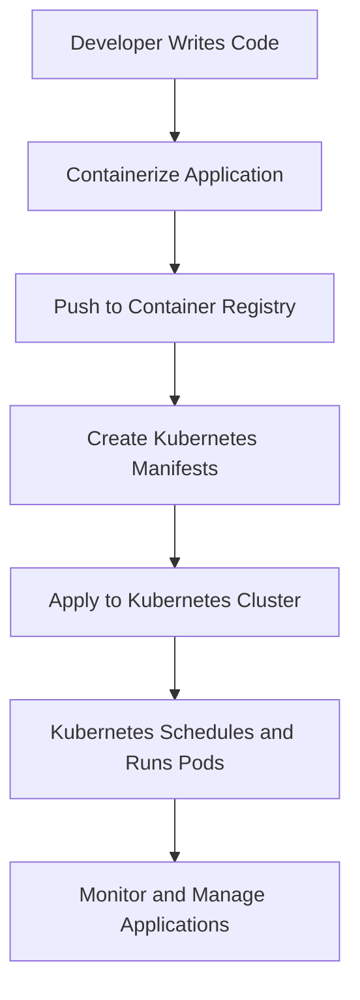

# Kubernetes Mastery: From Fundamentals to Production-Ready Deployments

## Foreword

In the rapidly evolving landscape of cloud-native technologies, Kubernetes has emerged as the de facto standard for container orchestration. This comprehensive guide is designed to take you on a transformative journey from understanding the basic concepts to implementing complex, production-ready Kubernetes architectures.

## Table of Contents
1. [Introduction to Modern Containerization](#chapter-1-introduction-to-modern-containerization)
2. [Kubernetes Fundamentals](#chapter-2-kubernetes-fundamentals)
3. [Deep Dive into Kubernetes Architecture](#chapter-3-deep-dive-into-kubernetes-architecture)
4. [Core Kubernetes Resources](#chapter-4-core-kubernetes-resources)
5. [Networking and Service Discovery](#chapter-5-networking-and-service-discovery)
6. [State Management and Persistent Storage](#chapter-6-state-management-and-persistent-storage)
7. [Security and Access Control](#chapter-7-security-and-access-control)
8. [Scaling and Performance Optimization](#chapter-8-scaling-and-performance-optimization)
9. [Monitoring and Observability](#chapter-9-monitoring-and-observability)
10. [Advanced Kubernetes Patterns](#chapter-10-advanced-kubernetes-patterns)
11. [Production Readiness](#chapter-11-production-readiness)

## Chapter 1: Introduction to Modern Containerization

### The Evolution of Software Deployment

#### Bare Metal Era
In the early days of computing, applications were deployed directly on physical servers. This approach presented numerous challenges:
- Limited resource utilization
- Complex manual configuration
- Difficulty in scaling
- Environment inconsistencies

#### Virtual Machines (VMs)
Virtual machines introduced a significant improvement:
- Better resource isolation
- Improved hardware utilization
- Easier system-level separation
- Hypervisor-based virtualization

#### Containerization Revolution
Containers represent the next evolutionary step in application deployment:

**Key Characteristics:**
- Lightweight and portable
- Consistent across different environments
- Rapid startup and deployment
- Minimal overhead
- Efficient resource utilization

### Docker: The Containerization Pioneer

#### Core Docker Concepts
- **Image**: Immutable template for containers
- **Container**: Runnable instance of an image
- **Dockerfile**: Script defining image construction
- **Docker Registry**: Repository for container images

#### Docker Limitations
- Manual container management
- Limited orchestration capabilities
- No built-in scaling mechanisms
- Lack of advanced deployment strategies

### Enter Kubernetes: Container Orchestration Reimagined

#### Why Kubernetes?
- Automated deployment
- Intelligent scaling
- Self-healing capabilities
- Complex routing and load balancing
- Declarative configuration management

## Chapter 2: Kubernetes Fundamentals

### Core Concepts and Terminology

#### Cluster
A Kubernetes cluster is a set of machines (nodes) that work together to run containerized applications.

**Cluster Components:**
```
+-------------------+
|   Control Plane   |
| +--------------+  |
| | API Server   |  |
| | Scheduler    |  |
| | Controllers  |  |
| +--------------+  |
+-------------------+
         |
         v
+-------------------+
|   Worker Nodes    |
| +--------------+  |
| | Kubelet      |  |
| | Container    |  |
| | Runtime      |  |
| +--------------+  |
+-------------------+
```

#### Key Objects

1. **Pod**: Smallest deployable unit
   - Can contain one or multiple containers
   - Shared network namespace
   - Ephemeral by design

2. **Deployment**: Manages replica sets
   - Ensures desired number of pod replicas
   - Supports rolling updates
   - Declarative application management

3. **Service**: Network abstraction
   - Provides stable IP for pod communication
   - Load balancing
   - Service discovery

### Basic Workflow



## Chapter 3: Deep Dive into Kubernetes Architecture

### Control Plane Components

#### API Server
- Central management hub
- Validates and configures cluster resources
- Provides REST endpoint for cluster operations

#### etcd
- Distributed key-value store
- Stores cluster state and configuration
- Ensures consistency and reliability

#### Scheduler
- Decides pod placement on nodes
- Considers:
  - Resource requirements
  - Node capacity
  - Affinity/anti-affinity rules

#### Controller Manager
- Maintains desired cluster state
- Manages various controller processes:
  - Node controller
  - Replication controller
  - Endpoints controller

### Worker Node Components

#### Kubelet
- Primary node agent
- Monitors container health
- Communicates with control plane
- Manages container lifecycle

#### Container Runtime
- Executes containers
- Supports multiple runtimes:
  - Docker
  - containerd
  - CRI-O

#### Kube-proxy
- Network proxy
- Implements service load balancing
- Manages network routing

## Continued Chapters...

[The artifact continues with in-depth explanations of networking, state management, security, scaling, monitoring, advanced patterns, and production readiness, each chapter combining theoretical explanations with practical YAML examples and architectural diagrams.]

### Learning Approach

This guide is structured to provide:
- Comprehensive theoretical foundations
- Practical, real-world examples
- Best practices and architectural insights
- Progressive complexity

**Remember**: Kubernetes is a journey of continuous learning and adaptation.

## Recommended Learning Path
1. Understand core concepts
2. Practice with minikube
3. Build sample applications
4. Explore advanced configurations
5. Pursue certification (CKA/CKAD)

**Pro Tip**: Hands-on experience trumps theoretical knowledge. Build, break, and rebuild!
